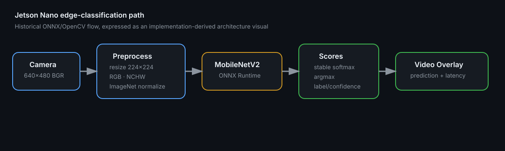

# Jetson Nano Edge Vision — MobileNetV2 ONNX Inference

[](https://github.com/syifaniads/ComputerVisionJetsonNano/actions/workflows/python-ci.yml)

An edge-inference study that takes a **MobileNetV2 ONNX model** validated in Colab and documents a camera inference path for **NVIDIA Jetson Nano** using OpenCV and ONNX Runtime.

The retained 2025 artifacts are the original notebook and setup notes. The reusable preprocessing module, tests, benchmark harness, and current runtime wrapper are a later portfolio engineering pass. They are explicitly separated from historical evidence.

<p align="center">
  
</p>

> **Visual provenance:** this diagram maps the historical README's actual ONNX/OpenCV inference flow plus the current testable runtime wrapper. It is not a fabricated Jetson benchmark screenshot.

## Retained technical evidence

The historical README documents this deployment flow:

```text
Colab-tested model
      ↓
MobileNetV2 ONNX artifact
      ↓ transfer
Jetson Nano
      ↓
OpenCV camera 640×480
      ↓
resize 224×224
BGR → RGB
HWC → CHW
scale /255
ImageNet mean/std normalization
      ↓
ONNX Runtime session
      ↓
class score → softmax → top label
      ↓
video overlay: label, confidence, inference ms
```

The exact historical preprocessing constants are preserved:

```python
mean = [0.485, 0.456, 0.406]
std  = [0.229, 0.224, 0.225]
```

The historical example opens `mobilenet_v2.onnx` and `imagenet_labels.txt`. This repository therefore presents the project as an **image-classification edge inference experiment**, not object detection with bounding boxes.

## Portfolio runtime

The current runtime keeps model-specific operations testable outside Jetson hardware:

```python
from src.onnx_classifier import preprocess_bgr, softmax, top_prediction

input_tensor = preprocess_bgr(frame, width=224, height=224)
probabilities = softmax(raw_scores)
label, confidence, class_id = top_prediction(probabilities, labels)
```

Run on a compatible Jetson/Python environment:

```bash
python runtime/jetson_camera.py \
  --model mobilenet_v2.onnx \
  --labels imagenet_labels.txt \
  --camera 0
```

The runtime discovers the ONNX input name from the model instead of assuming it is literally `input`.

## Tests and CI

Hardware-independent logic is covered with generated arrays:

- 224×224 NCHW output shape;
- BGR→RGB conversion;
- ImageNet normalization;
- numerically stable softmax;
- top-class/label selection.

```bash
pip install -r requirements-dev.txt
pytest -q
```

GitHub Actions does **not** claim to validate Jetson drivers, CUDA providers, camera devices, or ARM runtime compatibility on the hosted x86 runner.

## Benchmarking discipline

The historical sample measures only the `session.run(...)` duration. For a credible edge benchmark, [`docs/BENCHMARKING.md`](docs/BENCHMARKING.md) separates:

1. model-only inference latency;
2. end-to-end capture → preprocess → inference → overlay latency;
3. throughput/FPS;
4. CPU/GPU utilization, memory, temperature and throttling;
5. provider/runtime/version metadata.

No numerical Jetson FPS/latency is claimed because a retained reproducible hardware benchmark result is not available in the public source.

## Senior technical review path

| Review question | Inspect |
|---|---|
| What did the historical deployment actually do? | original notebook + [`docs/PROVENANCE.md`](docs/PROVENANCE.md) |
| Is preprocessing reproducible? | [`src/onnx_classifier.py`](src/onnx_classifier.py) |
| How is model I/O handled? | [`runtime/jetson_camera.py`](runtime/jetson_camera.py) |
| What would a real benchmark record? | [`docs/BENCHMARKING.md`](docs/BENCHMARKING.md) |
| What is not being claimed? | [`docs/LIMITATIONS.md`](docs/LIMITATIONS.md) |
| Is the pure logic tested? | [`tests/test_onnx_classifier.py`](tests/test_onnx_classifier.py) |

## Jetson-specific caveat

The original instructions used `pip3 install onnxruntime`. In practice, Jetson Nano software is constrained by its JetPack/L4T, Python, CUDA/cuDNN, architecture, and runtime combination. The portfolio intentionally avoids hard-coding a modern wheel URL or claiming GPU acceleration. [`scripts/setup_jetson_notes.sh`](scripts/setup_jetson_notes.sh) records the environment checks to perform before selecting an ONNX Runtime build/provider.

## Scope

This repository demonstrates model export/deployment thinking, computer-vision preprocessing, ONNX inference, camera integration, latency instrumentation, and edge-device operational constraints. It is not presented as a production autonomous-robot perception stack, and no TensorRT/CUDA speedup is claimed without retained evidence.
